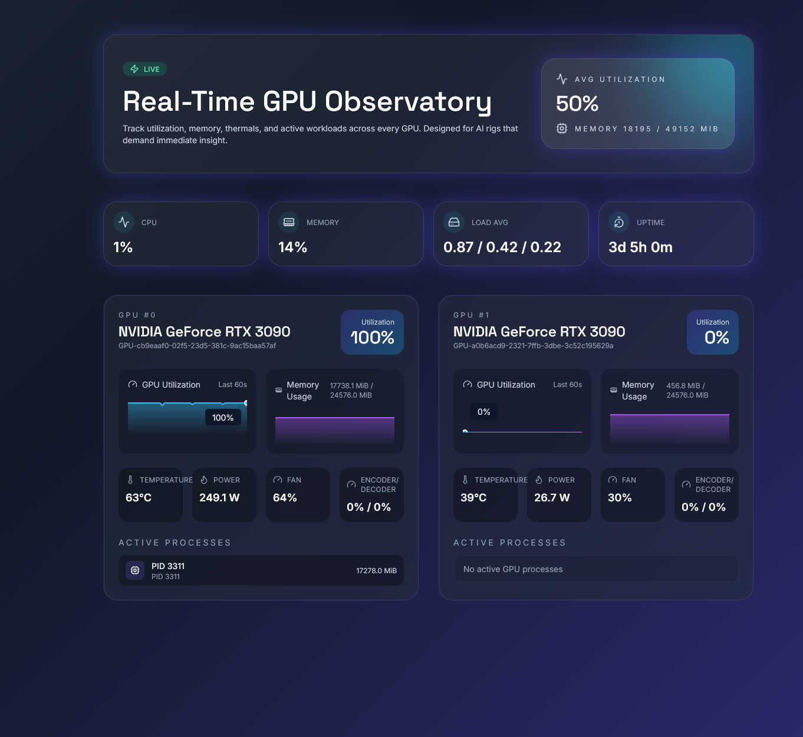

# Real-Time GPU Observatory

<div align="center">


**A modern, real-time GPU monitoring dashboard designed for AI workstations and high-performance computing environments.**

[Features](#-features) • [Quick Start](#-quick-start) • [Architecture](#-architecture) • [Deployment](#-deployment) • [Troubleshooting](#-troubleshooting)

</div>

---

## 📸 Screenshot



*The dashboard provides a comprehensive, real-time view of GPU performance metrics, system statistics, and active workloads across all installed GPUs.*

> **Note:** If you have a screenshot of the running application, place it in `./docs/dashboard-screenshot.png` or update the path above.

---

## ✨ Features

### Core Capabilities

- **Real-Time Monitoring**: Live telemetry streaming via WebSocket with sub-second updates
- **Multi-GPU Support**: Monitor all installed NVIDIA GPUs simultaneously
- **Comprehensive Metrics**: Track utilization, memory, temperature, power consumption, fan speed, and encoder/decoder usage
- **Process Tracking**: View active GPU processes with PID, memory usage, and user information
- **System Metrics**: Monitor CPU, memory, load average, and system uptime
- **Historical Visualization**: 60-second rolling history with sparkline charts for utilization and memory trends

### Technical Highlights

- **Modern Stack**: FastAPI backend with React + TypeScript frontend
- **Flexible Telemetry**: Automatic provider detection with graceful fallbacks (`pynvml` → `nvidia-smi` → `nvtop`)
- **Production Ready**: Docker support, systemd/PM2 configurations, and Nginx reverse proxy templates
- **Developer Friendly**: Hot reload, comprehensive testing, and clear project structure
- **Beautiful UI**: Dark theme with gradient accents, glassmorphism effects, and smooth animations

---

## 🏗️ Architecture

### System Overview

The GPU Monitoring system follows a **client-server architecture** with a **real-time streaming data pipeline**. The architecture is designed for low latency, high reliability, and easy extensibility.

```
┌─────────────────────────────────────────────────────────────────┐
│                         Frontend (React)                        │
│  ┌──────────────┐  ┌──────────────┐  ┌──────────────┐        │
│  │   Dashboard  │  │   GpuCard    │  │ SystemStats  │        │
│  └──────────────┘  └──────────────┘  └──────────────┘        │
│         │                  │                  │                │
│         └──────────────────┼──────────────────┘                │
│                            │                                    │
│                    WebSocket Connection                         │
└────────────────────────────┼────────────────────────────────────┘
                             │
                             ▼
┌─────────────────────────────────────────────────────────────────┐
│                    Backend (FastAPI)                            │
│  ┌──────────────────────────────────────────────────────────┐  │
│  │              Connection Manager                          │  │
│  │  • WebSocket connection handling                         │  │
│  │  • Rate limiting (configurable Hz)                      │  │
│  │  • Broadcast to all connected clients                    │  │
│  └──────────────────────────────────────────────────────────┘  │
│                            │                                    │
│                            ▼                                    │
│  ┌──────────────────────────────────────────────────────────┐  │
│  │            Telemetry Provider Factory                    │  │
│  │  • Auto-detection with fallback chain                    │  │
│  │  • Provider: pynvml → nvidia-smi → nvtop                 │  │
│  └──────────────────────────────────────────────────────────┘  │
│                            │                                    │
│         ┌──────────────────┼──────────────────┐                   │
│         ▼                  ▼                  ▼                   │
│  ┌─────────────┐  ┌─────────────┐  ┌─────────────┐            │
│  │  PyNVML     │  │ NVIDIA-SMI  │  │    NVTOP    │            │
│  │  Provider   │  │  Provider   │  │  Provider   │            │
│  └─────────────┘  └─────────────┘  └─────────────┘            │
│         │                  │                  │                │
│         └──────────────────┼──────────────────┘                │
│                            ▼                                    │
│                    System Metrics                               │
│                    (CPU, Memory, etc.)                          │
└─────────────────────────────────────────────────────────────────┘
```

### Data Flow

#### 1. **Telemetry Collection**

The backend continuously polls GPU metrics at a configurable interval (default: 1 second):

1. **Provider Selection**: The factory pattern automatically selects the best available provider:
   - **Primary**: `pynvml` - Direct Python bindings to NVML, provides rich metrics and process enumeration
   - **Fallback 1**: `nvidia-smi` - Parses JSON output from the NVIDIA System Management Interface
   - **Fallback 2**: `nvtop` - Parses output from the nvtop monitoring tool

2. **Metric Aggregation**: Each provider collects:
   - **GPU Metrics**: Utilization, memory (used/total/free), temperature, power usage, fan speed, encoder/decoder utilization
   - **Process Information**: PID, process name, memory usage per process
   - **System Metrics** (optional): CPU usage, system memory, load average, uptime

3. **Data Normalization**: All providers output a consistent JSON schema regardless of the underlying data source

#### 2. **WebSocket Broadcasting**

The telemetry data flows through the connection manager:

1. **Stream Generation**: The telemetry provider yields normalized payloads asynchronously
2. **Rate Limiting**: The connection manager throttles broadcasts to a maximum frequency (default: 5 Hz) to prevent overwhelming clients
3. **Deduplication**: Identical consecutive payloads are skipped to reduce network traffic
4. **Broadcast**: All connected WebSocket clients receive the same payload simultaneously

#### 3. **Frontend Rendering**

The React frontend consumes the WebSocket stream:

1. **Connection Management**: The `useGpuStream` hook manages WebSocket lifecycle:
   - Automatic reconnection on disconnect
   - Connection status indicators
   - Error handling and retry logic

2. **State Management**: 
   - Real-time metrics are stored in React state
   - Historical data (60-second rolling window) is maintained for sparkline charts
   - Aggregated statistics (average utilization, total memory) are computed via memoization

3. **UI Updates**:
   - Components re-render on new data arrival
   - Framer Motion provides smooth transitions
   - Recharts renders sparkline visualizations
   - Tailwind CSS handles responsive layout and styling

### Component Architecture

#### Backend Components

```
backend/
├── app/
│   ├── main.py                 # FastAPI application entry point
│   ├── config.py              # Configuration management (Pydantic Settings)
│   ├── api/                   # API route handlers
│   ├── core/
│   │   └── logging.py         # Logging configuration
│   ├── services/
│   │   └── connection_manager.py  # WebSocket connection management
│   └── telemetry/
│       ├── base.py            # Abstract base class for providers
│       ├── factory.py         # Provider factory with auto-detection
│       ├── pynvml_provider.py # PyNVML implementation
│       ├── nvidia_smi_provider.py  # nvidia-smi parser
│       ├── nvtop_provider.py  # nvtop parser
│       └── system_metrics.py  # System-level metrics collection
```

#### Frontend Components

```
frontend/
├── src/
│   ├── App.tsx                # Main application component
│   ├── components/
│   │   ├── GpuCard.tsx        # Individual GPU metrics card
│   │   ├── MetricSparkline.tsx # Sparkline chart component
│   │   ├── ProcessList.tsx    # Active processes display
│   │   ├── StatusBadge.tsx    # Connection status indicator
│   │   └── SystemStats.tsx    # System metrics overview
│   ├── hooks/
│   │   └── useGpuStream.ts    # WebSocket hook with reconnection
│   ├── types/
│   │   └── index.ts           # TypeScript type definitions
│   └── utils/
│       └── format.ts           # Data formatting utilities
```

### Technology Stack

| Layer | Technology | Purpose |
|-------|-----------|---------|
| **Backend Framework** | FastAPI | High-performance async API framework |
| **WebSocket** | Starlette WebSocket | Real-time bidirectional communication |
| **Telemetry** | PyNVML / nvidia-smi / nvtop | GPU metrics collection |
| **System Metrics** | psutil | CPU, memory, and system statistics |
| **Frontend Framework** | React 18 | Component-based UI library |
| **Language** | TypeScript | Type-safe frontend development |
| **Build Tool** | Vite | Fast development server and build tool |
| **Styling** | Tailwind CSS | Utility-first CSS framework |
| **Charts** | Recharts | React charting library |
| **Animations** | Framer Motion | Production-ready motion library |
| **Icons** | Lucide React | Beautiful icon library |

---

## 🚀 Quick Start

### Prerequisites

- **Python 3.10+** with pip
- **Node.js 18+** with npm
- **NVIDIA GPU** with drivers installed
- **nvidia-smi** available in PATH (verify with `nvidia-smi`)

### Option 1: Docker Compose (Recommended)

The fastest way to get started:

```bash
# Clone the repository
git clone <repository-url>
cd gpu-monitoring

# Build and start all services
docker compose up --build

# Access the dashboard
# Frontend: http://localhost:3000
# Backend API: http://localhost:5000
```

The Docker setup includes:
- Automatic GPU device passthrough
- Hot reload for development
- Proper networking between services

### Option 2: Local Development

#### Backend Setup

```bash
# Navigate to backend directory
cd backend

# Create virtual environment
python3 -m venv .venv

# Activate virtual environment
# On Windows:
.venv\Scripts\activate
# On Linux/macOS:
source .venv/bin/activate

# Install dependencies
pip install -r requirements.txt

# Start the backend server
uvicorn app.main:app --reload --host 0.0.0.0 --port 5000
```

The backend will be available at `http://localhost:5000`.

#### Frontend Setup

```bash
# Navigate to frontend directory
cd frontend

# Install dependencies
npm install

# Start the development server
npm run dev
```

The frontend will be available at `http://localhost:3000` with automatic API proxying.

### Option 3: Using Make

```bash
# Install dependencies
make install-backend
make install-frontend

# Start services (in separate terminals)
make start-backend
make start-frontend
```

---

## ⚙️ Configuration

### Environment Variables

The backend can be configured via environment variables (prefixed with `GPU_MONITOR_`) or a `.env` file:

| Variable | Default | Description |
|----------|---------|-------------|
| `GPU_MONITOR_POLL_INTERVAL_MS` | `1000` | Telemetry polling interval in milliseconds (minimum: 100ms) |
| `GPU_MONITOR_WS_MAX_RATE_HZ` | `5` | Maximum WebSocket broadcast frequency (1-30 Hz) |
| `GPU_MONITOR_LOG_LEVEL` | `INFO` | Python logging level (DEBUG, INFO, WARNING, ERROR) |
| `GPU_MONITOR_ENABLE_SYSTEM_METRICS` | `true` | Include system-level metrics (CPU, memory, etc.) |
| `GPU_MONITOR_TELEMETRY_PROVIDER` | `null` | Force specific provider: `pynvml`, `nvidia_smi`, or `nvtop` (auto-detect if unset) |

### Example `.env` File

Create a `.env` file in the `backend/` directory:

```env
GPU_MONITOR_POLL_INTERVAL_MS=500
GPU_MONITOR_WS_MAX_RATE_HZ=10
GPU_MONITOR_LOG_LEVEL=DEBUG
GPU_MONITOR_ENABLE_SYSTEM_METRICS=true
```

### Telemetry Provider Selection

The system automatically selects the best available provider:

1. **PyNVML** (Preferred): Rich metrics, process enumeration, best performance
   - Install: `pip install pynvml`
   - Requires: NVIDIA drivers with NVML support

2. **nvidia-smi** (Fallback): Basic metrics, no process details
   - Requires: `nvidia-smi` command available
   - No additional installation needed

3. **nvtop** (Last Resort): Parses nvtop JSON output
   - Install: `nvtop >= 3.0` with JSON support
   - Requires: `nvtop --json` command available

To force a specific provider, set `GPU_MONITOR_TELEMETRY_PROVIDER` to the desired value.

---

## 🧪 Testing

### Backend Tests

```bash
cd backend
source .venv/bin/activate  # or .venv\Scripts\activate on Windows
pytest
```

Tests cover:
- Telemetry provider initialization
- Connection manager functionality
- WebSocket broadcasting
- Data normalization

### Frontend Linting

```bash
cd frontend
npm run lint
```

---

## 📦 Deployment

### Production Deployment Options

#### Option 1: Docker Compose (Recommended for Single Server)

1. **Build production images**:
   ```bash
   docker compose -f docker-compose.yml build
   ```

2. **Configure environment variables** in `docker-compose.yml` or `.env`

3. **Start services**:
   ```bash
   docker compose up -d
   ```

4. **Set up Nginx reverse proxy** using `deployment/nginx/gpu-monitor.conf` as a template

#### Option 2: Systemd Service

1. **Copy the systemd service file**:
   ```bash
   sudo cp deployment/systemd/gpu-monitor-backend.service /etc/systemd/system/
   ```

2. **Edit the service file** to match your paths and user:
   ```ini
   [Service]
   User=your-user
   WorkingDirectory=/path/to/gpu-monitoring/backend
   ExecStart=/path/to/gpu-monitoring/backend/.venv/bin/uvicorn app.main:app --host 0.0.0.0 --port 5000
   ```

3. **Enable and start the service**:
   ```bash
   sudo systemctl daemon-reload
   sudo systemctl enable gpu-monitor-backend
   sudo systemctl start gpu-monitor-backend
   ```

#### Option 3: PM2 Process Manager

1. **Install PM2**:
   ```bash
   npm install -g pm2
   ```

2. **Start the backend**:
   ```bash
   pm2 start deployment/pm2/ecosystem.config.cjs
   ```

3. **Save PM2 configuration**:
   ```bash
   pm2 save
   pm2 startup
   ```

### Nginx Configuration

Use the provided Nginx configuration template (`deployment/nginx/gpu-monitor.conf`) as a starting point:

```nginx
server {
    listen 80;
    server_name your-domain.com;

    # Redirect HTTP to HTTPS
    return 301 https://$server_name$request_uri;
}

server {
    listen 443 ssl http2;
    server_name your-domain.com;

    ssl_certificate /path/to/cert.pem;
    ssl_certificate_key /path/to/key.pem;

    # Frontend
    location / {
        root /path/to/frontend/dist;
        try_files $uri $uri/ /index.html;
    }

    # Backend API
    location /api {
        proxy_pass http://localhost:5000;
        proxy_set_header Host $host;
        proxy_set_header X-Real-IP $remote_addr;
    }

    # WebSocket
    location /ws {
        proxy_pass http://localhost:5000;
        proxy_http_version 1.1;
        proxy_set_header Upgrade $http_upgrade;
        proxy_set_header Connection "upgrade";
        proxy_set_header Host $host;
        proxy_set_header X-Real-IP $remote_addr;
    }
}
```

### Frontend Production Build

```bash
cd frontend
npm run build
```

The production build will be in `frontend/dist/` and can be served by Nginx or any static file server.

---

## 🔧 Troubleshooting

### Common Issues

#### Backend won't start

**Issue**: `No telemetry provider available`

**Solution**: 
- Ensure NVIDIA drivers are installed: `nvidia-smi` should work
- Install PyNVML: `pip install pynvml`
- Check that `nvidia-smi` is in your PATH

#### WebSocket connection fails

**Issue**: Frontend shows "Disconnected" status

**Solution**:
- Verify backend is running on port 5000
- Check firewall settings
- Ensure Nginx config includes WebSocket upgrade headers (see deployment section)
- Check browser console for connection errors

#### No GPUs detected

**Issue**: Dashboard shows "No GPUs detected"

**Solution**:
- Verify GPUs are accessible: `nvidia-smi -L` should list GPUs
- Check that the service user has permission to access GPU devices
- For Docker: Ensure GPU passthrough is configured (`--gpus all` or `deploy.resources.reservations.devices`)

#### High CPU usage

**Issue**: Backend consumes excessive CPU

**Solution**:
- Increase `POLL_INTERVAL_MS` to reduce polling frequency
- Reduce `WS_MAX_RATE_HZ` to limit broadcast frequency
- Use PyNVML provider instead of nvidia-smi (more efficient)

#### Permission errors

**Issue**: `nvidia-smi` requires sudo

**Solution**:
- Ensure the service user is in the appropriate groups
- Configure udev rules if necessary
- For Docker: Use `--privileged` flag or configure device access properly

### Debug Mode

Enable debug logging:

```bash
export GPU_MONITOR_LOG_LEVEL=DEBUG
```

Or in `.env`:
```env
GPU_MONITOR_LOG_LEVEL=DEBUG
```

### Health Check

Verify backend is running:

```bash
curl http://localhost:5000/api/health
```

Expected response:
```json
{
  "status": "ok",
  "timestamp": "2024-01-01T00:00:00.000000",
  "pollIntervalMs": 1000,
  "provider": "pynvml"
}
```

---

## 📚 API Reference

### REST Endpoints

#### `GET /api/health`

Health check endpoint.

**Response**:
```json
{
  "status": "ok",
  "timestamp": "2024-01-01T00:00:00.000000",
  "pollIntervalMs": 1000,
  "provider": "pynvml"
}
```

#### `GET /api/config`

Get current configuration.

**Response**:
```json
{
  "pollIntervalMs": 1000,
  "maxBroadcastHz": 5,
  "provider": "pynvml",
  "enableSystemMetrics": true
}
```

### WebSocket Endpoint

#### `WS /ws/gpu`

Real-time telemetry stream.

**Message Format**:
```json
{
  "timestamp": "2024-01-01T00:00:00.000000",
  "gpus": [
    {
      "id": 0,
      "name": "NVIDIA GeForce RTX 3090",
      "uuid": "GPU-xxxx-xxxx-xxxx",
      "utilization": 100,
      "memoryUsed": 17738.1,
      "memoryTotal": 24576.0,
      "memoryFree": 6837.9,
      "temperature": 63,
      "powerUsage": 249.1,
      "powerLimit": 350.0,
      "fanSpeed": 64,
      "encoderUtilization": 0,
      "decoderUtilization": 0,
      "processes": [
        {
          "pid": 3311,
          "name": "python",
          "usedMemoryMiB": 17278.0
        }
      ]
    }
  ],
  "system": {
    "cpuUsage": 1.0,
    "memoryUsage": 14.0,
    "loadAverage": [0.87, 0.42, 0.22],
    "uptime": 273600
  }
}
```

---

## 🤝 Contributing

Contributions are welcome! Please follow these guidelines:

1. Fork the repository
2. Create a feature branch (`git checkout -b feature/amazing-feature`)
3. Commit your changes (`git commit -m 'Add some amazing feature'`)
4. Push to the branch (`git push origin feature/amazing-feature`)
5. Open a Pull Request

### Development Guidelines

- Follow existing code style and conventions
- Add tests for new features
- Update documentation as needed
- Ensure all tests pass before submitting

---

## 📄 License

This project is licensed under the MIT License - see the LICENSE file for details.

---

## 🙏 Acknowledgments

- **NVIDIA** for NVML and driver support
- **FastAPI** for the excellent async framework
- **React** and the open-source community for amazing tools
- **Tailwind CSS** for the utility-first CSS framework

---

## 📞 Support

For issues, questions, or contributions:

- Open an issue on GitHub
- Check existing documentation
- Review the troubleshooting section

---

<div align="center">

**Built with ❤️ for the AI/ML community**

[⬆ Back to Top](#real-time-gpu-observatory)

</div>
